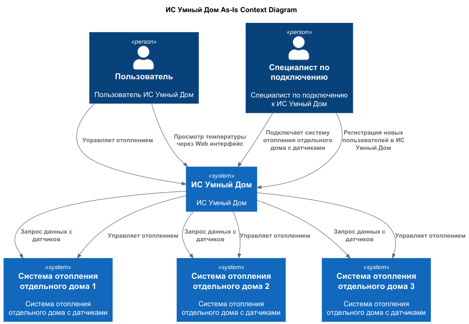
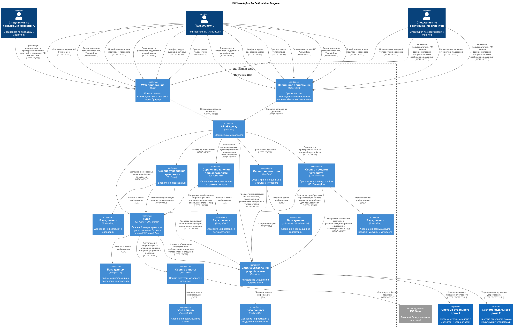
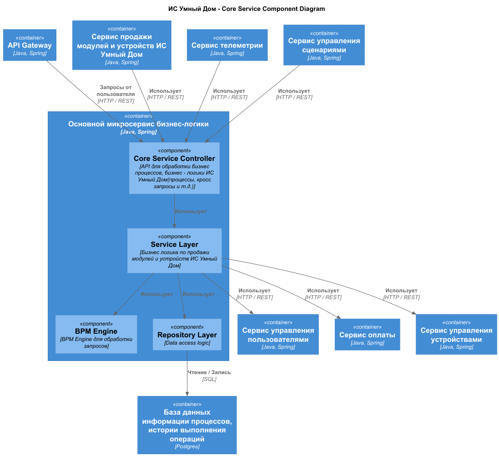
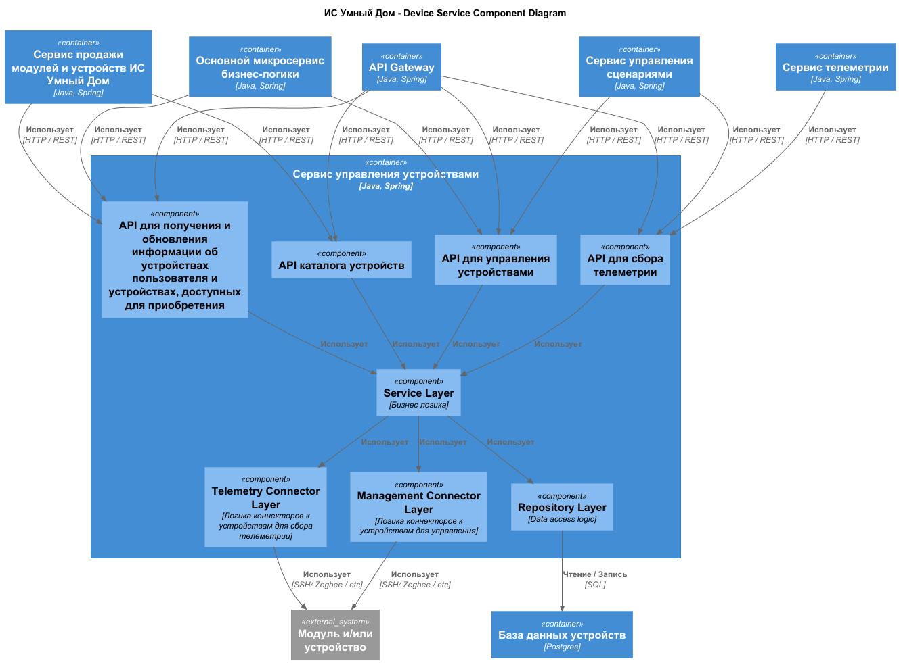
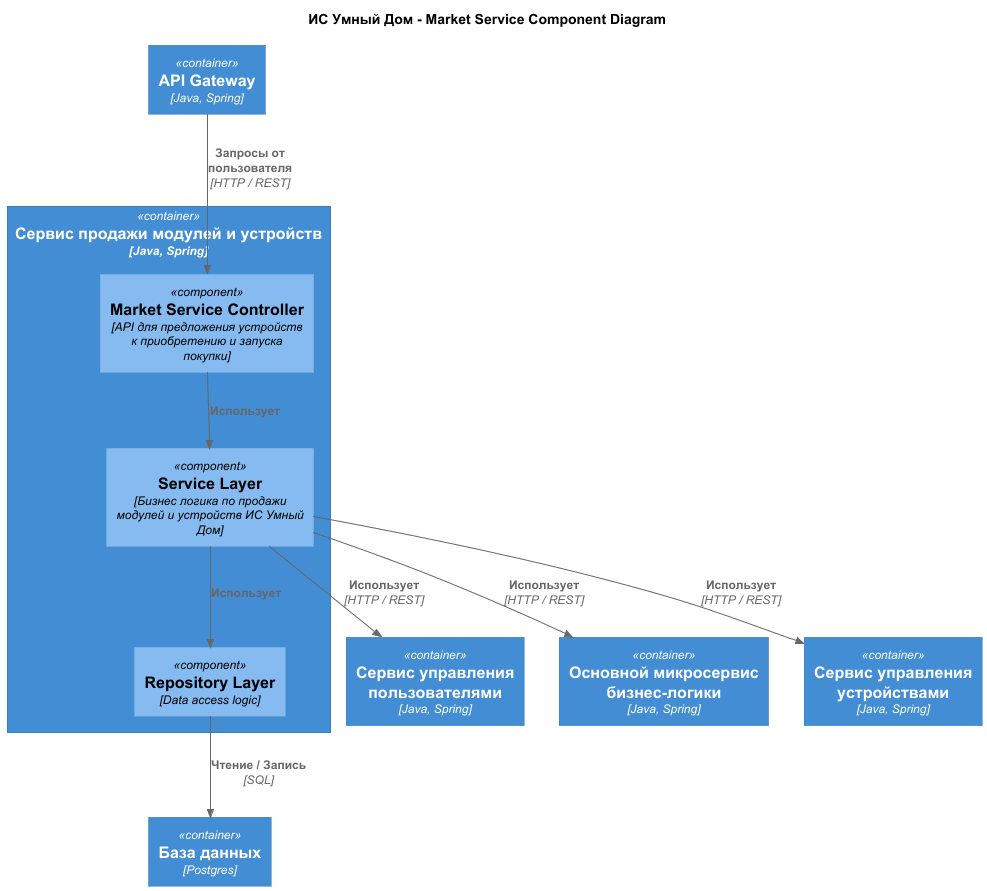
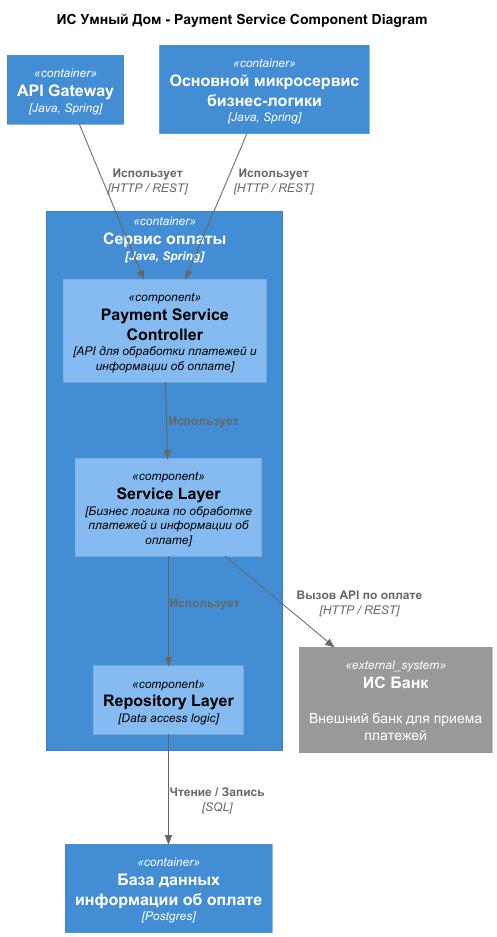
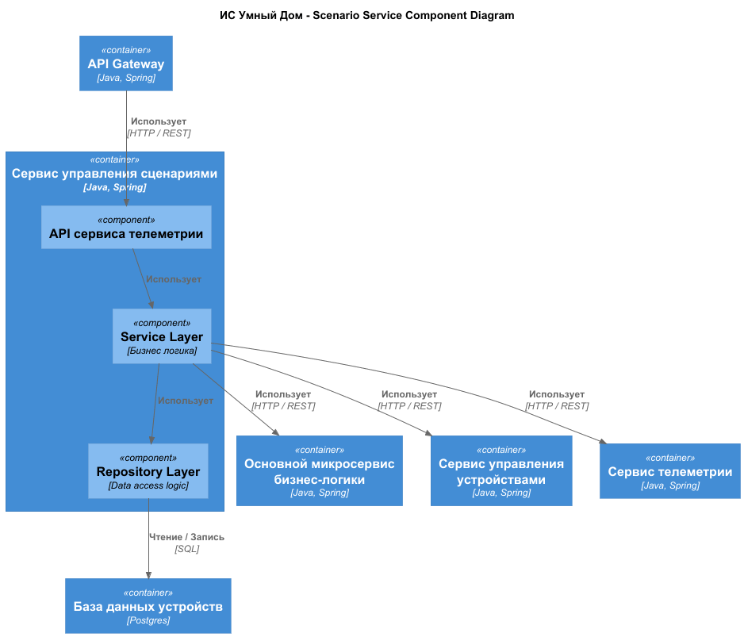
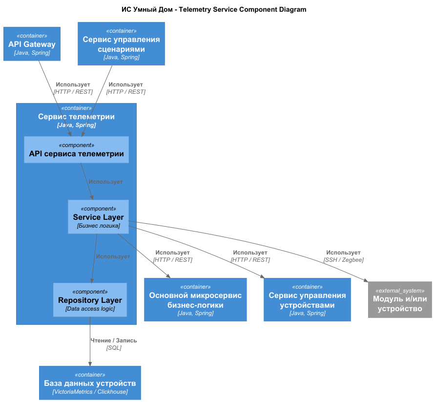
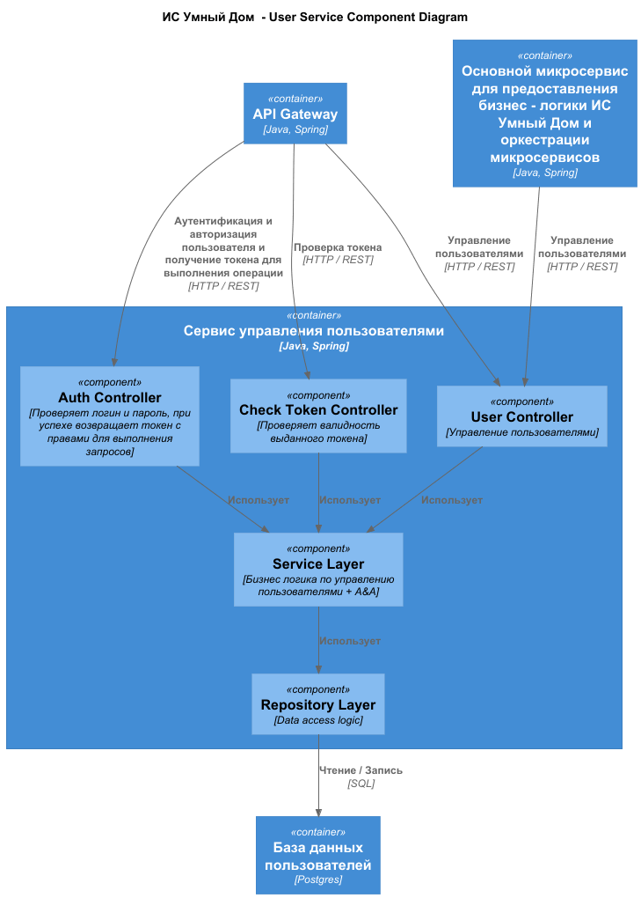
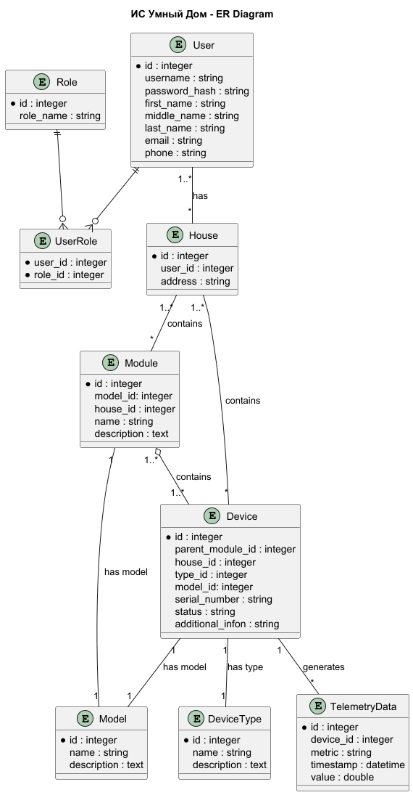

# Project_template

Это шаблон для решения проектной работы. Структура этого файла повторяет структуру заданий. Заполняйте его по мере работы над решением.

# Задание 1. Анализ и планирование

### 1. Описание функциональности монолитного приложения

**Управление отоплением:**

- Пользователи могут удаленно управлять отоплением в доме. 
- Система поддерживает только синхронное управление от сервера к датчику. 
- Система не поддерживает асинхронные вызовы. 

**Мониторинг температуры:**

- Пользователи могут удаленно проверять температуру.
- Система поддерживает только получение температуры через запрос от сервера к датчику.
- Система не поддерживает реактивное взаимодействие от датчика к серверу.

### 2. Анализ архитектуры монолитного приложения

Монолит на Go с СУБД Postgres. Только Синхронное взаимодействие без асинхронных вызовов и реактивного взаимодействия. 
Все запросы идут от сервера к датчику.


### 3. Определение доменов и границы контекстов
Домен: продажа модулей и устройств
- поддомен витрины модулей и устройств 
    - контекст: витрина модулей и устройств
- поддомен продажи выбранных модулей и устройств
    - контекст: продажа выбранных модулей и устройств
- поддомен рекомендаций к приобретению
    - контекст: рекомендаций к приобретению

Домен: управление модулями и устройствами(отопление, свет, ворота, наблюдение)
- поддомен подключение модуля и устройства
  - контекст: подключение устройства 
- поддомен каталог модулей и устройств
- поддомен управления
    - контекст: управление модулями и устройствами

Домен: сценарии управления 
- контекст: сценарии управления модулями и устройствами

Домен: телеметрия
- поддомен сбора телеметрии
- поддомен хранения телеметрии 
- поддомен выдачи данных телеметрии

Домен: оплата
- поддомен оплаты модулей и устройств
- поддомен оплаты подписки к ИС Умный Дом 

Домен: пользователи и роли
- поддомен управлениями пользователями системы и их ролями
- поддомен аутентификации и авторизации действий пользователей

### **4. Проблемы монолитного решения**
- Синхронная блокирующая обработка запросов.
- Может отказать вся система при критической ошибке в какой-то части функциональности. 
- Высокий риск сбоев при изменениях.
- Надо тестировать все приложение целиком при изменениях. 
- Внесение изменений потребует перезапуска всего приложения.
- Масштабирование только для приложения целиком.
- Единый маленький стек технологий для всего приложения(сложно реализовывать разные виды взаимодействия, ограничения 
по возможностям языка программирования и так далее).

### 5. Визуализация контекста системы — диаграмма С4

Добавьте сюда диаграмму контекста в модели C4.

Чтобы добавить ссылку в файл Readme.md, нужно использовать синтаксис Markdown. Это делают так:

[C4 - Context](diagrams/As_Is_C4_Context.puml)


# Задание 2. Проектирование микросервисной архитектуры

В этом задании вам нужно предоставить только диаграммы в модели C4. Мы не просим вас отдельно описывать получившиеся микросервисы и то, как вы определили взаимодействия между компонентами To-Be системы. Если вы правильно подготовите диаграммы C4, они и так это покажут.

**Диаграмма контейнеров (Containers)**

[C4 - Containers](diagrams/To_Be_C4_Container.puml)


**Диаграмма компонентов (Components)**

[C4 - Component - ApiGateway](diagrams/To_Be_C4_Component_ApiGateway.puml)


[C4 - Component - CoreService](diagrams/To_Be_C4_Component_CoreService.puml)


[C4 - Component - DeviceService](diagrams/To_Be_C4_Component_DeviceService.puml)


[C4 - Component - MarketService](diagrams/To_Be_C4_Component_MarketService.puml)


[C4 - Component - PaymentService](diagrams/To_Be_C4_Component_PaymentService.puml)


[C4 - Component - ScenarioService](diagrams/To_Be_C4_Component_ScenarioService.puml)


[C4 - Component - TelemetryService](diagrams/To_Be_C4_Component_TelemetryService.puml)


[C4 - Component - UserService](diagrams/To_Be_C4_Component_UserService.puml)



**Диаграмма кода (Code)**

Добавьте одну диаграмму или несколько.

# Задание 3. Разработка ER-диаграммы

[ER-диаграмма](diagrams/ER.puml)


# Задание 4. Создание и документирование API

### 1. Тип API

Укажите, какой тип API вы будете использовать для взаимодействия микросервисов. Объясните своё решение.
Для взаимодействия между микросервисами для начала я бы предложил использовать REST API.
REST API прост в использовании, синхронный, удобно документирован, стандартизирован, версионируемый. Но в дальнейшем 
для взаимодействия между некоторыми микросервисами я бы добавил асинхронное взаимодействие через брокер сообщений, напрмиер, Kafka.

### 2. Документация API

Здесь приложите ссылки на документацию API для микросервисов, которые вы спроектировали в первой части проектной работы. Для документирования используйте Swagger/OpenAPI или AsyncAPI.

[API для микросервиса DeviceService](swagger.yaml)

# Задание 5. Работа с docker и docker-compose

Перейдите в apps.

Там находится приложение-монолит для работы с датчиками температуры. В README.md описано как запустить решение.

Вам нужно:

1) сделать простое приложение temperature-api на любом удобном для вас языке программирования, которое при запросе /temperature?location= будет отдавать рандомное значение температуры.

Locations - название комнаты, sensorId - идентификатор названия комнаты

```
	// If no location is provided, use a default based on sensor ID
	if location == "" {
		switch sensorID {
		case "1":
			location = "Living Room"
		case "2":
			location = "Bedroom"
		case "3":
			location = "Kitchen"
		default:
			location = "Unknown"
		}
	}

	// If no sensor ID is provided, generate one based on location
	if sensorID == "" {
		switch location {
		case "Living Room":
			sensorID = "1"
		case "Bedroom":
			sensorID = "2"
		case "Kitchen":
			sensorID = "3"
		default:
			sensorID = "0"
		}
	}
```

2) Приложение следует упаковать в Docker и добавить в docker-compose. Порт по умолчанию должен быть 8081

3) Кроме того для smart_home приложения требуется база данных - добавьте в docker-compose файл настройки для запуска postgres с указанием скрипта инициализации ./smart_home/init.sql

Для проверки можно использовать Postman коллекцию smarthome-api.postman_collection.json и вызвать:

- Create Sensor
- Get All Sensors

Должно при каждом вызове отображаться разное значение температуры

Ревьюер будет проверять точно так же.


